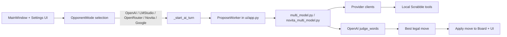
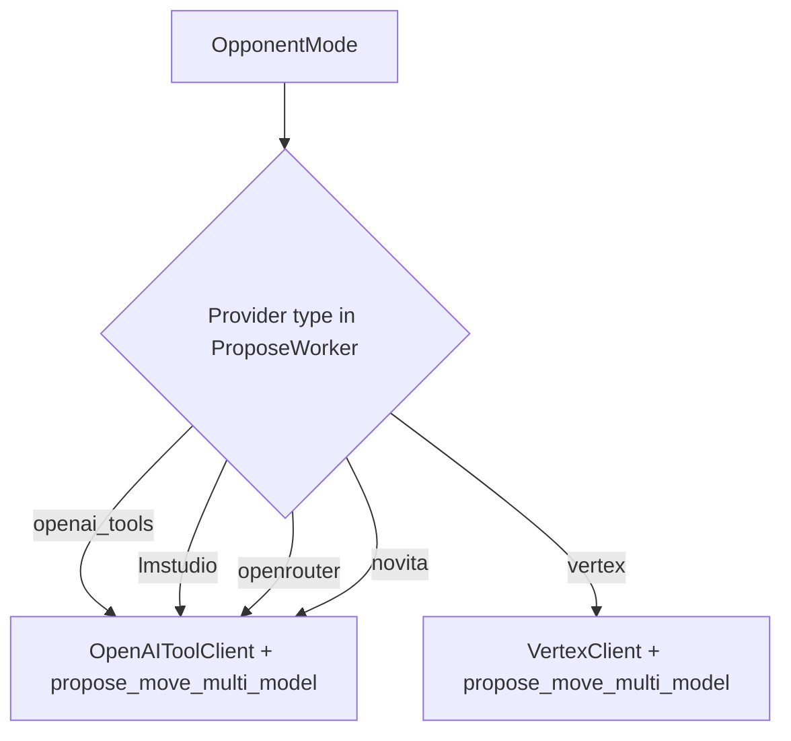
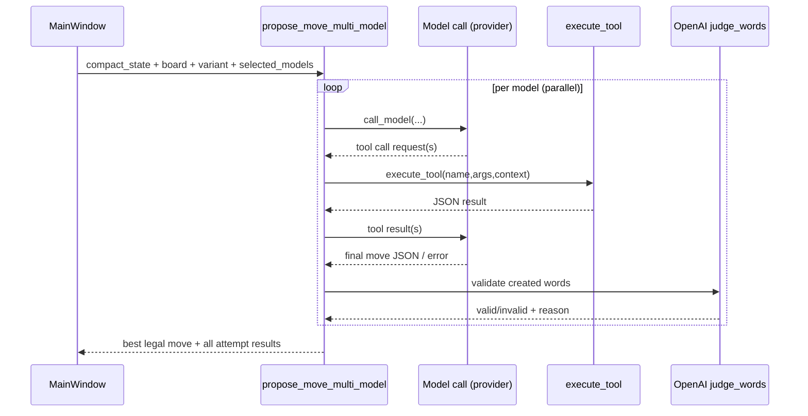

# ScrabGPT Architecture Map

Updated: February 23, 2026

This document is a fast onboarding map for future coding agents.
It focuses on runtime flow (provider selection, multi-model orchestration, tool loop)
and where to extend the system safely.

## North Star

The project objective is to build a Scrabble AI opponent that reaches superhuman quality
and becomes practically unbeatable for human players.

## 1. Runtime Topology

Main entrypoint:
- `scrabgpt/ui/app.py:4311` (`MainWindow._start_ai_turn`)

Provider worker branch:
- `scrabgpt/ui/app.py:4355` (`ProposeWorker`)

## 2. Provider Routing (Current)

Key modules:
- `scrabgpt/ai/openai_tools_client.py`
- `scrabgpt/ai/openrouter.py`
- `scrabgpt/ai/novita.py`
- `scrabgpt/ai/vertex.py`
- `scrabgpt/ai/multi_model.py`
- `scrabgpt/ai/novita_multi_model.py`

## 3. Multi-Model + Tool Loop

Tool registry source of truth:
- `scrabgpt/ai/mcp_tools.py` (`ALL_TOOLS`)

Tool adapters:
- OpenAI schema: `scrabgpt/ai/tool_adapter.py:get_openai_tools`
- Gemini schema: `scrabgpt/ai/tool_adapter.py:get_gemini_tools`
- Execution bridge: `scrabgpt/ai/tool_adapter.py:execute_tool`

## 4. Data & Persistence

Runtime and user configuration:
- `~/.scrabgpt/config.json` (opponent mode + provider selections)
- `~/.scrabgpt/teams/` (legacy/provider team files)

Variants:
- Installed variants: `scrabgpt/assets/variants/*.json`
- Active variant env key: `SCRABBLE_VARIANT`
- Wikipedia cache: `scrabgpt/assets/variants/wikipedia_scrabble_cache.html`

## 5. Observability Surfaces

UI observability:
- Attempts table: `scrabgpt/ui/model_results.py`
- Agent profiling: `scrabgpt/ui/agents_dialog.py`
- Chat/context telemetry: `scrabgpt/ui/chat_dialog.py`
- Response detail inspection: `scrabgpt/ui/response_detail.py`

Logging:
- Central config: `scrabgpt/logging_setup.py`
- Trace propagation variable: `TRACE_ID_VAR`

## 6. High-Impact Improvement Tracks

For the “practically unbeatable” AI goal, prioritize:

1. Prompt quality pipeline
- Stronger candidate generation prompts (opening/midgame/endgame specific variants).
- Better anti-blunder constraints in `_UNIFIED_MOVE_PROMPT_TEMPLATE`.
- Prompt A/B tests wired to benchmark scenarios.

2. Tool-search depth and ranking
- Increase candidate diversity before finalization.
- Add board-control heuristics, leave quality modeling, and risk-aware ranking.
- Penalize opening premium lanes unless EV gain compensates.

3. Evaluation loop
- Expand `tests/test_api_prompt_benchmark.py` scenario catalog.
- Add automated leaderboard per model/prompt version.
- Add self-play tournaments for regression detection.

4. Reliability
- Reduce fallbacks by improving primary parse reliability.
- Continue splitting `ui/app.py` into smaller orchestration modules.

## 7. First Files To Read (New Agent)

1. `scrabgpt/ui/app.py` (turn orchestration + provider routing)
2. `scrabgpt/ai/multi_model.py` (core concurrent orchestration)
3. `scrabgpt/ai/openai_tools_client.py` (iterative tool loop)
4. `scrabgpt/ai/mcp_tools.py` (available local Scrabble tools)
5. `scrabgpt/core/rules.py` + `scrabgpt/core/scoring.py` (ground truth legality/scoring)
6. `tests/test_api_prompt_benchmark.py` (quality target scenarios)

## 8. Current Known Gaps

- `scrabgpt/ai/agent_player.py` is a stub (`NotImplementedError`).
- `MainWindow._on_user_chat_message` in `scrabgpt/ui/app.py` is placeholder.
- `scrabgpt/ui/app.py` is still a large mixed-responsibility file.
